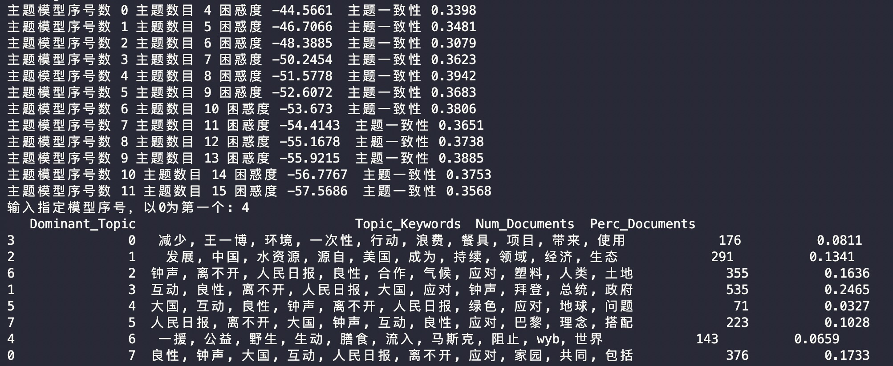
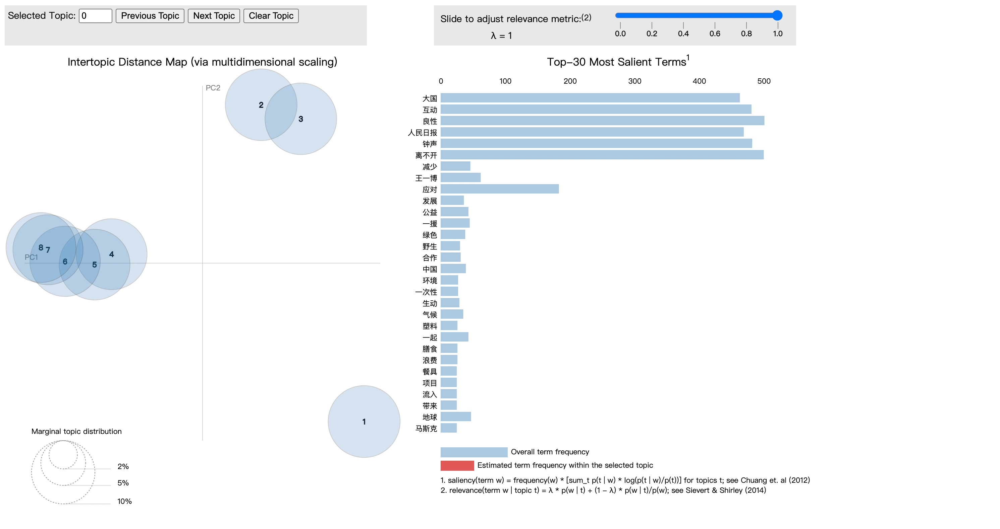

# weibo-opinion-analysis

## Brief introduction

## Usage

```shell
git clone https://github.com/Lan-ce-lot/weibo-opinion-analysis.git
```

```shell
pip install -r requirements_docs.txt
```

## Sept

### 微博爬虫
[weibo-search](https://github.com/Lan-ce-lot/weibo-search)

### 数据清洗+分词

### LDA主题建模
topic选择


可视化

### 文本情感分析

### 话题热度计算

### 主题相似度计算

### 绘图

---

## Ref
> [dataabc/weibo-search](https://github.com/dataabc/weibo-search)\
> [stay-leave/weibo-public-opinion-analysis](https://github.com/stay-leave/weibo-public-opinion-analysis)